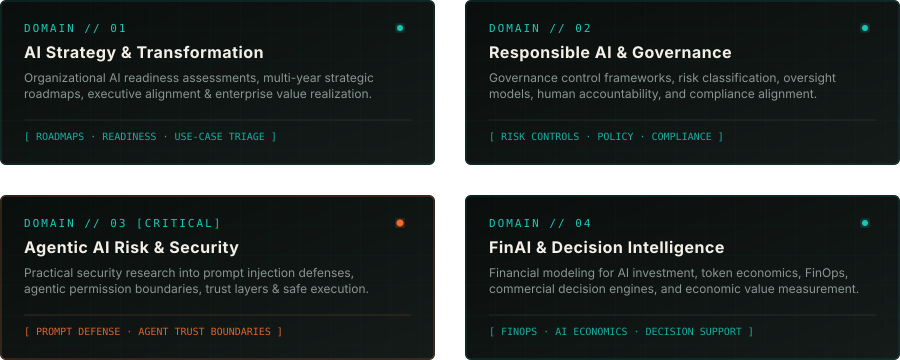

<!-- 
==============================================================================
NELC // SIGNAL ROOM
AI Transformation Consultant · Agentic AI Engineer · Founder, Nelc Digital
==============================================================================
-->

<p align="center">
  
</p>

<div align="center">

[](https://nelc.digital)
[](https://nelc.digital)
[](https://nelc.digital)

</div>

---

### `// POSITIONING STATEMENT`

> *"Turning AI ambition into governed, secure, commercially intelligent systems."*

I design, build, and deploy the **operating layer** for AI adoption in enterprise organizations, banks, fintechs, and high-growth technology companies. Rather than treating AI as disconnected tools or speculative pilots, I focus on building **resilient operating models, governance control boundaries, secure agentic architectures, and verifiable economic models**.

---

## 01 / SYSTEM MANIFEST

<p align="center">
  
</p>

```gcode
SYS_MANIFEST // ID: NELC_DIGITAL_01
--------------------------------------------------------------------------------
IDENTITY     :: AI Transformation Consultant & Agentic AI Engineer
STUDIO       :: Nelc Digital (Founder)
LOCATION     :: Lagos, Nigeria [6.5244° N, 3.3792° E] — Serving Global Markets
MISSION      :: Governed AI. Secure adoption. Measurable commercial value.

FOCUS        :: [01] AI Strategy & Enterprise Roadmaps
             :: [02] Responsible AI & Governance Control Models
             :: [03] Agentic AI Risk & Security Engineering
             :: [04] FinAI, FinOps & Commercial Decision Intelligence

STATUS       :: Designing intelligent operating systems for enterprise & fintechs
--------------------------------------------------------------------------------
```

---

## 02 / OPERATING DOMAINS

<p align="center">
  
</p>

<table width="100%">
<tr>
<td width="50%" stroke="#18C7B5">

### 01. AI Strategy & Transformation
* **Focus**: Readiness assessments, strategy roadmaps, executive alignment, and priority use-case triage.
* **Impact**: Transitioning enterprises from isolated AI experiments to systematic, value-accretive operating models.
* **Deliverables**: AI Maturity Frameworks, Implementation Roadmaps, C-Suite Decision Briefings.

</td>
<td width="50%">

### 02. Responsible AI & Governance
* **Focus**: Governance control frameworks, risk classification, oversight models, and human accountability.
* **Impact**: Ensuring regulatory compliance, ethical guardrails, and auditability for financial and regulated institutions.
* **Deliverables**: Policy Engine Specs, Model Risk Registries, Compliance Audits.

</td>
</tr>
<tr>
<td width="50%">

### 03. Agentic AI Risk & Security
* **Focus**: Defensive security for autonomous agent workflows, prompt-injection countermeasures, and permission boundaries.
* **Impact**: Protecting enterprise data, credentials, and downstream execution layers from emerging agentic attack vectors.
* **Deliverables**: Agent Trust Boundary Specs, Threat Matrix Models, Injection Test Harnesses.

</td>
<td width="50%">

### 04. FinAI & Decision Intelligence
* **Focus**: Financial modeling for AI investment, token economics, FinOps, and automated commercial decision engines.
* **Impact**: Aligning raw model performance with unit economics, margin impact, and financial return on investment.
* **Deliverables**: FinAI Cost Models, Token Unit Economics Calculators, Decision Dashboards.

</td>
</tr>
</table>

---

## 03 / SELECTED SYSTEMS & FRAMEWORKS

Enterprise-ready architecture patterns, governance frameworks, and technical specifications:

```
┌─────────────────────────────────────────────────────────────────────────────┐
│ [ SYSTEM 01 ]  AI READINESS & MATURITY DIAGNOSTIC LAYER                      │
│                Assessing organizational readiness, priority use cases,      │
│                data infrastructure maturity, risk exposure, and multi-year  │
│                transformation pathways.                                     │
├─────────────────────────────────────────────────────────────────────────────┤
│ [ SYSTEM 02 ]  GOVERNANCE CONTROL & OVERSIGHT SPEC                          │
│                Operationalizing policy, human-in-the-loop oversight models, │
│                risk classification, auditability, and regulatory alignment. │
├─────────────────────────────────────────────────────────────────────────────┤
│ [ SYSTEM 03 ]  FINAI VALUE & COST MODEL ENGINE                              │
│                Quantifying token unit economics, infra operating assumptions│
│                commercial impact, and financial decision support.           │
├─────────────────────────────────────────────────────────────────────────────┤
│ [ SYSTEM 04 ]  AGENTIC AI SECURITY & TRUST LAB                              │
│                Practical research & test suits into prompt-injection        │
│                defenses, agent permissions, trust boundaries, & workflows.  │
└─────────────────────────────────────────────────────────────────────────────┘
```

---

## 04 / SIGNALS // THOUGHT LEADERSHIP

Curated writing, architectural frameworks, and research papers on AI implementation, governance, and economics:

- **`SIGNAL_001`** — [**AI Governance Frameworks for Financial Institutions**](https://nelc.digital/writing/governance-fintech)  
  *Designing audit-ready oversight layers, model risk controls, and regulatory compliance for African and international banks.*

- **`SIGNAL_002`** — [**The Economics of Enterprise AI Adoption**](https://nelc.digital/writing/ai-economics)  
  *Moving beyond model performance metrics to token unit economics, infra cost modeling, and commercial ROI.*

- **`SIGNAL_003`** — [**Threat Vectors & Security Boundaries in Agentic AI**](https://nelc.digital/writing/agent-security)  
  *Deconstructing indirect prompt injection, tool-call privilege escalation, and trust boundaries in multi-agent systems.*

- **`SIGNAL_004`** — [**From AI Pilots to Operating Models**](https://nelc.digital/writing/pilots-to-operating-models)  
  *Why 80% of enterprise AI initiatives stall at proof-of-concept and how to build a scalable AI Operating Layer.*

---

## 05 / SIGNATURE SIGNAL FIELD

<p align="center">
  
</p>

---

## 06 / BUILD LOG // NOW EXPLORING

```diff
+ [CURRENT_FOCUS]  Designing enterprise agent permission boundaries & tool sandbox specs
+ [RESEARCH_AXIS]   Token unit economics & inference cost optimization for FinAI
+ [FRAMEWORK]       AI Readiness & Transformation Framework v2.4
+ [GEOGRAPHY]       Decision Intelligence and AI infrastructure for West African enterprises
```

---

## 07 / CONNECT & DISCOVERY

Whether you are an enterprise executive planning an AI transformation roadmap, a bank/fintech navigating AI governance & security, or a partner seeking specialized technical advisory:

<div align="center">

| Channel | Contact | Location / Focus |
| :--- | :--- | :--- |
| 🌐 **Studio** | [**Nelc Digital**](https://nelc.digital) | Strategic AI Consultancy & Engineering |
| 💼 **LinkedIn** | [**Connect on LinkedIn**](https://linkedin.com) | Executive Insights & Professional Network |
| ✍️ **Writing & Signals** | [**Read Articles**](https://nelc.digital/signals) | Deep-dive Frameworks & Research |
| 📬 **Direct Email** | `consult@nelc.digital` | Enterprise Advisory & Keynotes |

</div>

<br />

<p align="center">
  
</p>
