<!-- 
==============================================================================
NELC // SIGNAL ROOM
AI Transformation Consultant · Agentic AI Engineer · Founder, Nelc Digital
==============================================================================
-->

  

---

  

---

## 01 / SYSTEM MANIFEST

  

---

## 02 / OPERATING DOMAINS

  

---

## 03 / SELECTED SYSTEMS & FRAMEWORKS

  

---

## 04 / SIGNALS // THOUGHT LEADERSHIP

  

  

  

  

  

  

---

## 05 / SIGNATURE SIGNAL FIELD

  

---

## 06 / BUILD LOG // NOW EXPLORING

  

---

## 07 / CONNECT & DISCOVERY

  

  

  

  

